# Patient Chat Application

## 1. Purpose

This Patient Chat Application is a Django-based web chatbot designed to facilitate health-related conversations between patients and an AI bot. The AI is programmed to handle health inquiries, provide information about care plans, and detect requests for changes in treatment or appointments. It filters out irrelevant or sensitive topics and can escalate specific requests to doctors when necessary.

## 2. Technical Solutions and Tech Stack

- **Backend Framework**: Django
- **Frontend**: Django templates with HTML, CSS, and JavaScript
- **AI Bot**: Developed using Langgraph framework
  - Implemented as a multi-agent system
  - Based on SQL/Graph knowledge base
- **Databases**:
  - **Graph Database**: Neo4j
    - Connected to Django app using py2neo
  - **Relational Database**: PostgreSQL, SQLite
    - Integrated using Django ORM and psycopg2
- **ORM**: Django's built-in ORM
- **Authentication**: Django's authentication system
- **Version Control**: Git

## 3. Project Environment Setup

- **Key Files and Their Purposes**

  - `PatientChatApp/settings.py`: Contains project-wide settings, including database configurations.
  - `PatientChatApp/urls.py`: Defines the main URL patterns for the project.
  - `chatbot/models.py`: Defines the data models for patients and doctors.
  - `chatbot/views.py`: Contains the logic for handling requests and generating responses.
  - `chatbot/urls.py`: Defines URL patterns specific to the chatbot app.
  - `templates/chatbot.html`: The main template for the chat interface.
  - `manage.py`: Django's command-line utility for administrative tasks.
  - `requirements.txt`: Lists all Python dependencies for the project.

- **[Clone the repository](https://github.com/joshuagrundmeyer0710/PatientChatApp.git)**

  ```bash
  git clone https://github.com/yourusername/PatientChatApp.git
  ```

- **Python Environment Setup**

  - Create a virtual environment:
    ```bash
    python -m venv venv
    ```
    - Windows
      ```bash
      venv\Scripts\activate
      ```
    - Unix
      ```bash
      source venv/bin/activate
      ```
  - Install dependencies:
    ```bash
    pip install -r requirements.txt
    ```

- **Database Configurations**

  - PostgreSQL

    Change setting in `PatientChatApp/settings.py`

    ```python

    # PostgreSQL plugin definition in `PatientChatApp/settings.py`
    DATABASES = {
        'default': {
            'ENGINE': 'django.db.backends.postgresql',
            'NAME': 'your_database_name',
            'USER': 'your_database_user',
            'PASSWORD': 'your_database_password',
            'HOST': 'localhost',
            'PORT': '5432',
        }
    }

    ```

    or

    ```python
    import psycopg2

    # Connect to local PostgreSQL server
    conn = psycopg2.connect(
        host="localhost",
        port="5432",
        database="your_database_name",
        user="you_database_user",
        password="you_database_password"
    )

    cur = conn.cursor()

    # # Create table
    cur.execute("YOUR_QUERY_HERE")
    ```

  - Graph database(neo4j)

    ```python
    from py2neo import Graph

    # Credentials
    NEO4J_URI = "bolt://localhost:7687"
    NEO4J_USERNAME = "your_neo4j_username"
    NEO4J_PASSWORD = "your_neo4j_password"
    NEO4J_DB_NAME = "your_neo4j_db_name"

    graph = Graph(NEO4J_URI, auth=(NEO4J_USERNAME, NEO4J_PASSWORD), name=NEO4J_DB_NAME)
    ```

## 4. Run the Application

- **Configure Django Project**
  - Basic configuration
    ```bash
    python manage.py makemigrations
    python manage.py migrate
    ```
  - Create a superuser for Django admin
    ```bash
    python manage.py createsuperuser
    ```
  - Run the development server
    ```bash
    python manage.py runserver
    ```
  - Open the browser and navigate to `http://localhost:8000`
  - Sample admin login: `username: admin, password: admin`
  - Sample user login: `username: test, password: test`

## 5. Implementation Explanation

### Project Structure

⚠️ **IMPORTANT**: This Patient Chat Application is following Django project structure. Here I will only mention about how I implement the chatbot functionality leveraging multi-agent system and Langgraph framework.

### Multi-agent system schema

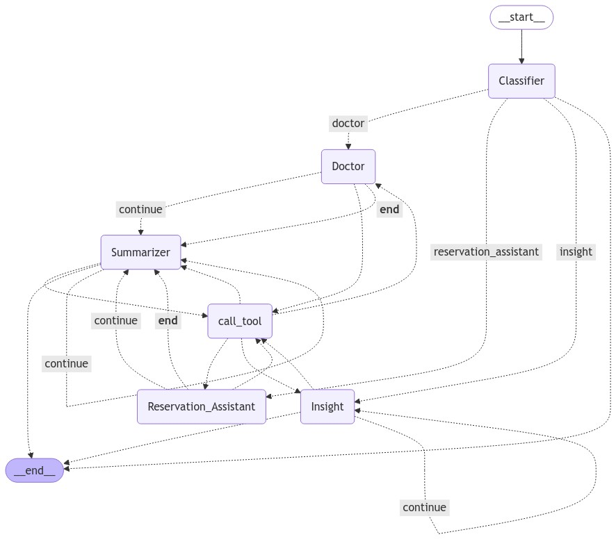

### Nodes Implementation

- Classifier Node - Responsible for classifying user queries

  - Output

    - `MEDICATION CONTEXT`
    - `RESERVATION CONTEXT`
    - `INSIGHT CONTEXT`
    - `CONTINUE CONTEXT`
    - `OUT OF CONTEXT`

  - implementation

    ```python
    def create_agent_for_classifier(llm, tools, system_message: str):
    """Create a agent that classifies the user input is related to medical and reservation-related things or not."""
      <DEFINITION HERE>

    classifier_agent = create_agent_for_classifier(
      llm=llm,
      tools=[tavily_tool,
            get_patient_detail,
            get_chat_history_from_patient_username],
      system_message="""
          You should classfy the input into four categories:
          1. MEDICATION CONTEXT
          2. RESERVATION CONTEXT
          3. INSIGHT CONTEXT
          4. CONTINUE CONTEXT
          5. OUT OF CONTEXT
          Maybe patient will ask questions about himself or greetings. In that case, you classify that as MEDICATION CONTEXT.
          If patient asks insight for his medical condition or regimen or diet, you classify that into INSIGHT CONTEXT.
          Also if patient ask about the topic from the chat history, you classify that into suitable context so the team knows to continue.
          For example, patient asked about how aspirin helps headache and is asking about what his former question was. In this case,
          this question should be classified as CONTINUE CONTEXT.
          You should answer based on the chat history of a patient.
      """
    )
    ```

- Doctor Node - Responsible for answering the medication related questions

  - Output

    - Return answer to state respone

  - implementation

    ```python
    def create_agent_for_nodes(llm, tools, system_message: str):
        """Create a agent that answers the user input that is related to medical or reservation-related things."""
      <DEFINITION HERE>

    doctor_agent = create_agent_for_nodes(
        llm=llm,
        tools=[tavily_tool,
              get_chat_history_from_patient_username,
              get_patient_detail],
        system_message="""
            Patient will ask you about medical stuff or something about his medication or regimen or diet.
            Maybe he also ask you about something in the chat history.
            You should answer based on the chat history of a patient.
        """
    )
    ```

- Reservation_Assistant Node - Responsible for answering the reservation related questions

  - Output

    - Return answer to state respone

  - implementation

    ```python
    def create_agent_for_nodes(llm, tools, system_message: str):
        """Create a agent that answers the user input that is related to medical or reservation-related things."""
      <DEFINITION HERE>

    reservation_assistant_agent = create_agent_for_nodes(
        llm=llm,
        tools=[tavily_tool,
              get_patient_detail,
              get_chat_history_from_patient_username,
              get_doctor_detail,
              get_reservation_detail_from_patient_username,
              get_reservation_detail_from_doctor_name,
              get_reservation_detail_from_detailed_information,
              create_reservation_change_request],
        system_message="""
            You should answer the question based on information provided and chat history.
            1. You also need to check if the patient wants to create or reschedule or cancel a reservation.
            2. And in the case patient wants to reschedule or cancel the reservation, you must make sure which reservation patient wants to change.
            3. And in the case you patient wants to create the reservation, you must make sure the information patient provided is complete to create one.
            If yes, you should respond to the patient with something like
            "I will convey your request to Dr. [Doctor's Name].
            Patient, [Patient Name] is requesting an appointment with Dr. [Doctor's Name] change from [Previous Detail] to [Requested Detail]."
            And add that to reservationRequest table.
            If not, you should ask for more information when you find it clear enough.
        """
    )
    ```

- Summarizer Node - Responsible for saving extracted entities into graph database

  - Output

    - Save extracted entities into graph database

  - implementation

    ```python
    def create_agent_for_insight(llm, tools, system_message: str):
    """Create a agent that answers the user input that is related to medical or reservation-related things."""
      <DEFINITION HERE>

    insight_agent = create_agent_for_insight(
        llm=llm,
        tools=[tavily_tool,
              get_all_doctor_detail,
              get_chat_history_from_patient_username,
              knowledge_graph_medical_stuff_of_patient,
              create_insight_record_in_postgres_db],
        system_message="""
            You have to give the insight of patient's medical condition, regimen, diet or treatment plat.
            First, you check the patient's detail.
            Second, you check the chat history and investigate patient's intention.
            Third, you have to give the step-by-step, detailed insight for patient and his treatment.
            Fourth, you can check the doctor's information and suggest to make a reservation with the suitable one.
            Fifth, you have to store generated insight into postgreSQL Database Insight table.
        """
    )
    ```

- Insight Node - Responsible for answering the insight related questions

  - Output

    - Give the insight of patient's medical condition, regimen, diet or treatment plan
    - Store the output into postgreSQL Database Insight table

  - implementation

    ```python
    def create_agent_for_insight(llm, tools, system_message: str):
    """Create a agent that answers the user input that is related to medical or reservation-related things."""
      <DEFINITION HERE>

    insight_agent = create_agent_for_insight(
        llm=llm,
        tools=[tavily_tool,
              get_all_doctor_detail,
              get_chat_history_from_patient_username,
              knowledge_graph_medical_stuff_of_patient,
              create_insight_record_in_postgres_db],
        system_message="""
            You have to give the insight of patient's medical condition, regimen, diet or treatment plan.
            First, you check the patient's detail.
            Second, you check the chat history and investigate patient's intention.
            Third, you have to give the step-by-step, detailed insight for patient and his treatment.
            Fourth, you can check the doctor's information and suggest to make a reservation with the suitable one.
            Fifth, you have to store generated insight into postgreSQL Database Insight table.
        """
    )
    ```

### Tools Implementation

- Tavily Tool - Responsible for searching the web
- create_medical_stuff_node_in_knowledge_graph - Responsible for creating medical stuff node in knowledge graph
- get_chat_history_from_patient_username - Responsible for getting chat history from patient username
- get_patient_detail - Responsible for getting patient detail from patient username
- get_doctor_detail - Responsible for getting doctor detail from doctor name
- get_reservation_detail_from_patient_username - Responsible for getting reservation detail from patient username
- get_reservation_detail_from_doctor_name - Responsible for getting reservation detail from
  doctor name
- get_reservation_detail_from_detailed_information - Responsible for getting reservation detail from detailed
  information
- create_reservation_change_request - Responsible for creating reservation change request
- get_all_doctor_detail - Responsible for getting all doctor detail
- knowledge_graph_medical_stuff_of_patient - Responsible for getting medical stuff of patient
- create_insight_record_in_postgres_db - Responsible for creating insight record in postgres db

```python
tools = [
    tavily_tool,
    create_medical_stuff_node_in_knowledge_graph,
    get_chat_history_from_patient_username,
    get_patient_detail,
    get_doctor_detail,
    get_reservation_detail_from_patient_username,
    get_reservation_detail_from_doctor_name,
    get_reservation_detail_from_detailed_information,
    create_reservation_change_request,
    get_all_doctor_detail,
    knowledge_graph_medical_stuff_of_patient,
    create_insight_record_in_postgres_db
]
tool_node = ToolNode(tools)
```

### Workflow Implementation

```python
workflow = StateGraph(HospitalAgentState)

workflow.add_node("Classifier", classifier_node)
workflow.add_node("Doctor", doctor_node)
workflow.add_node("Reservation_Assistant", reservation_assistant_node)
workflow.add_node("Summarizer", summarizer_node)
workflow.add_node("Insight", insight_node)
workflow.add_node("call_tool", tool_node)

workflow.add_edge(START, "Classifier")

workflow.add_conditional_edges(
    "Classifier",
    router_from_classfier,
    {"doctor": "Doctor", "reservation_assistant": "Reservation_Assistant",
        "insight": "Insight", "__end__": END}
)

workflow.add_conditional_edges(
    "Doctor",
    router_from_normal_nodes,
    {"continue": "Summarizer", "call_tool": "call_tool", "__end__": "Summarizer"}
)

workflow.add_conditional_edges(
    "Reservation_Assistant",
    router_from_normal_nodes,
    {"continue": "Summarizer", "call_tool": "call_tool", "__end__": "Summarizer"}
)

workflow.add_conditional_edges(
    "call_tool",
    lambda x: x["sender"],
    {"Doctor": "Doctor", "Reservation_Assistant": "Reservation_Assistant",
        "Summarizer": "Summarizer", "Insight": "Insight"}
)

workflow.add_conditional_edges(
    "Summarizer",
    router_from_summarizer,
    {"continue": "Summarizer", "call_tool": "call_tool",
        "__end__": END}  # For Scalability
)

workflow.add_conditional_edges(
    "Insight",
    router_from_normal_nodes,
    {"continue": "Insight", "call_tool": "call_tool",
        "__end__": END}  # For Scalability
)

graph = workflow.compile()
```

### Key Features Implementation

- Register

  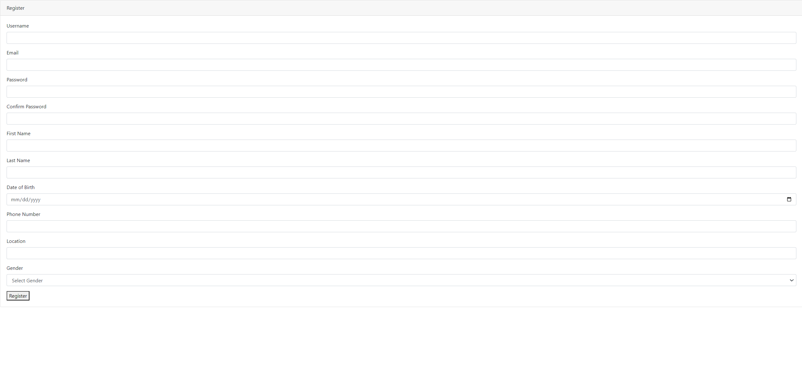

- LogIn/LogOut

  

  

- Data Models

  - User Model

    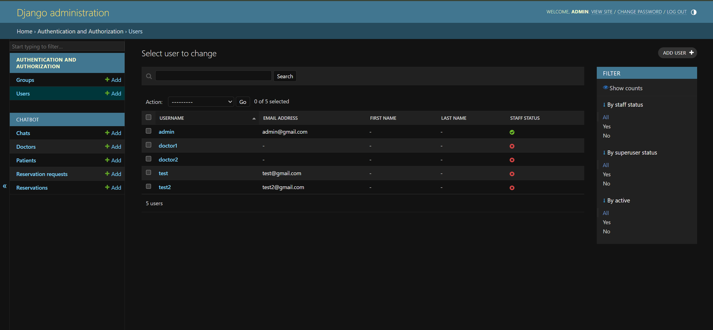

  - Patient Model

    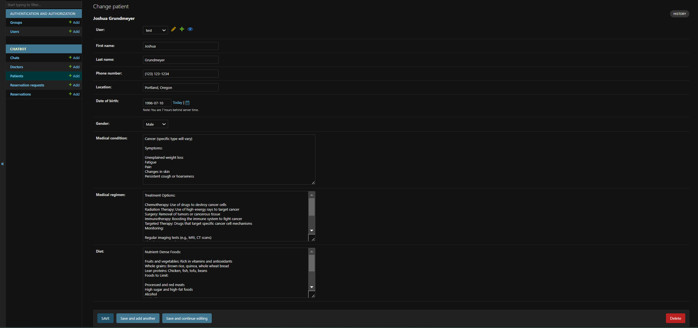

  - Doctor Model

    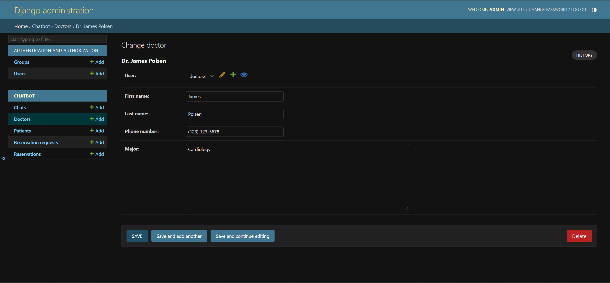

  - Chat Model

    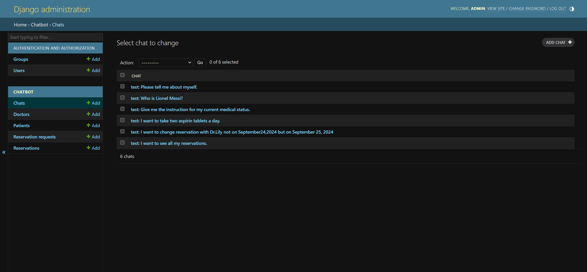

  - Reservation Model

    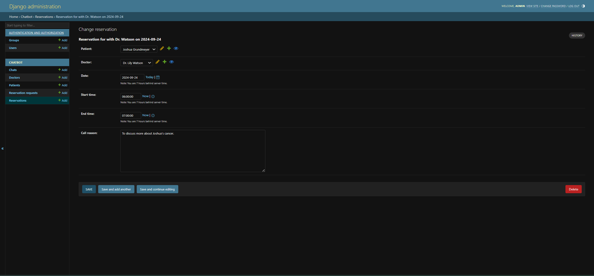

  - Reservation Change Request Model

    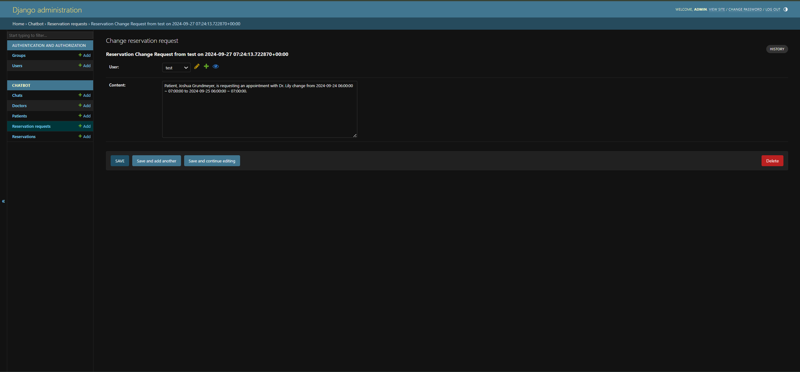

- Context Classification

  := Only respond to health-related questions, reservation-related questions, on-going context
  Refuse to answer question out of these contexts

  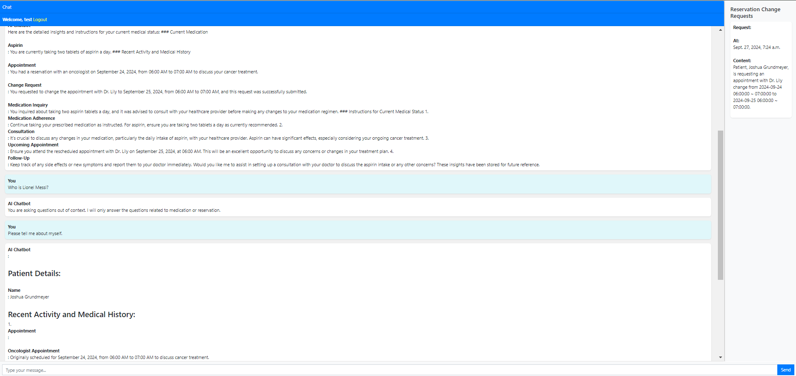

- Chat History
  := Interact with different chat history, database based on username(Used when logged in)

  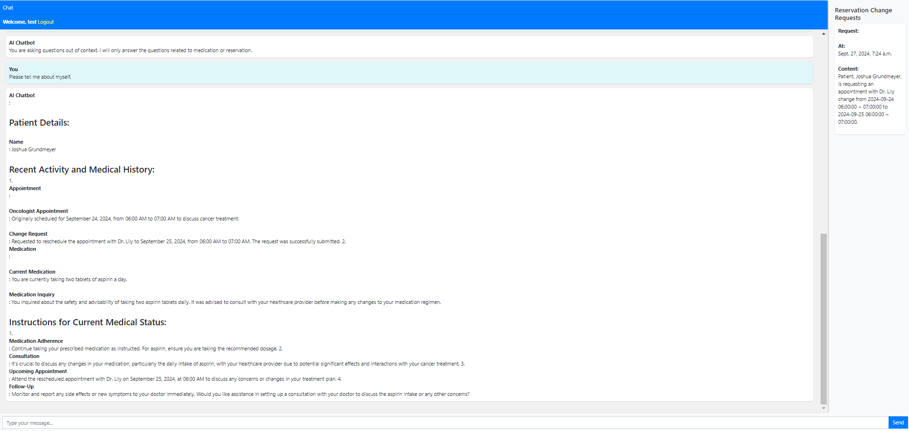

- Web Search for chat

  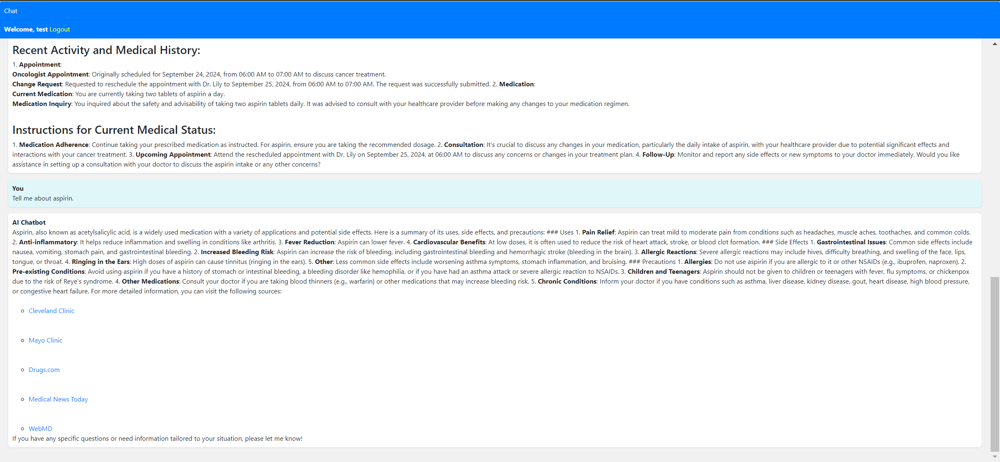

- Reservation Change Request detection and store in database

- Insight Provision and store in PostgreSQL database

  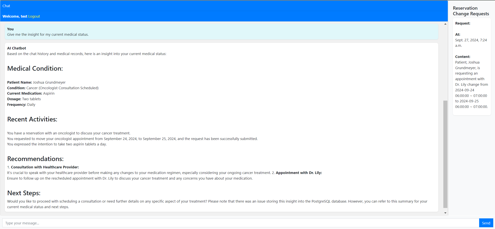

- Extract key entities and store in knowledge graph

  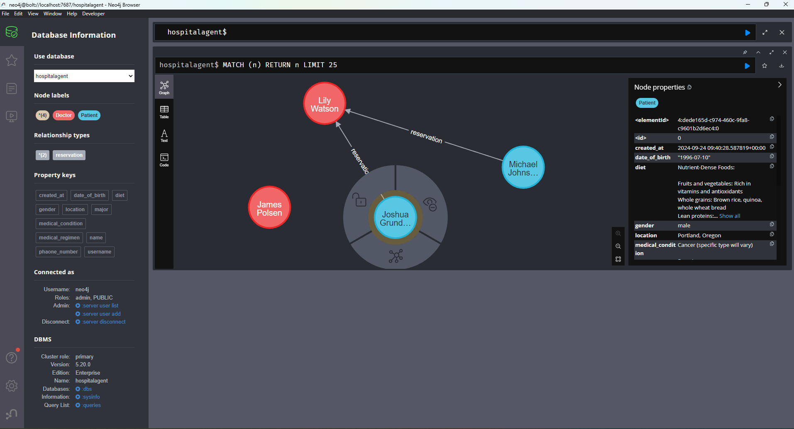

  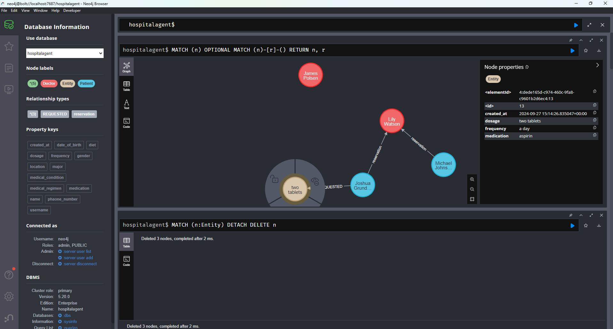

- LLM Agnostic Design and use of Langgraph

- Multi-agent system leveraging self-defined tools

## 6. Further Improvements

- Add more features for security and privacy policy
- Implement vector search on knowledge graph for semantic retrieval
- Interactive interface
